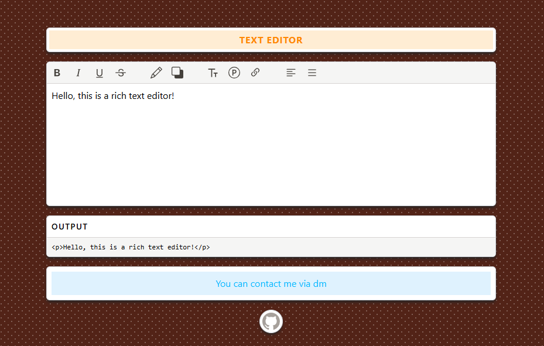

# Text Editor

A modern text editor built with **Vite, React, and Tailwind CSS**. This project leverages TipTap-based editor components to offer advanced text formatting options for a seamless editing experience.

  
*Note: The above screenshot is for demonstration purposes. Run the application to see the live preview.*

## Live

Try out the text editor in action:
**[View Live](https://text-editor-dm.vercel.app)**

## Features

- **Rich Text Formatting:** Basic formatting options such as bold, italic, underline, and more
- **Advanced Color Controls:** Change text and highlight colors with ease
- **Font Size Controls:** Adjust the font size to suit your needs
- **Heading and List Controls:** Quickly add headings, bullet lists, and numbered lists
- **Text Alignment:** Easily align text (left, center, right)
- **Link Insertion:** Insert hyperlinks effortlessly
- **Real-time Output:** Live HTML output preview of the edited text
- **Responsive Design:** Works seamlessly across different screen sizes
- **Accurate Dropdown Positioning:** Dropdowns are always correctly positioned thanks to FloatingUI.

## Technologies

- **[React](https://reactjs.org/):** For building interactive user interfaces
- **[Vite](https://vitejs.dev/):** A fast development server and build tool
- **[Tailwind CSS](https://tailwindcss.com/):** A utility-first CSS framework for rapid styling
- **[TipTap](https://tiptap.dev/):** A powerful framework for building rich text editors
- **[React Icons](https://react-icons.github.io/react-icons/):** For scalable vector icons
- **[FloatingUI](https://floating-ui.com/docs/react):** Provides accurate and robust positioning for dropdowns and tooltips.

## Installation

1. **Clone the repository:**

   ```bash
   git clone https://github.com/adambornrepo/text-editor.git
   cd text-editor
   ```

2. **Install dependencies:**

   ```bash
   npm install
   ```

3. **Start the development server:**

   ```bash
   npm run dev
   ```

4. **Open your browser:**
   
   Navigate to `http://localhost:5173` to see the application running.

## Project Structure

```
text-editor/
├── public/             # Static assets
├── src/
│   ├── components/     # UI components
│   │   ├── DropdownContainer.jsx
│   │   ├── TextFormatToolbar.jsx
│   │   ├── FontSizeControls.jsx
│   │   ├── LinkControls.jsx
│   │   ├── HeadingControls.jsx
│   │   ├── ListControls.jsx
│   │   ├── AlignmentControls.jsx
│   │   ├── TextColorControls.jsx
│   │   └── HighlightColorControls.jsx
│   ├── utils/          # Helper functions
│   │   ├── editorConfig.js
│   │   └── colorPalette.js
│   ├── TextEditor.jsx  # Main editor component
│   ├── main.jsx        # Application entry point
│   └── index.css       # Global styles
├── index.html          # HTML template
├── vite.config.js      # Vite configuration
└── package.json        # Project dependencies
```

## Building for Production

To build the application for production, run:

```bash
npm run build
```

The build artifacts will be stored in the `dist/` directory.

## Preview Production Build

To preview the production build locally, run:

```bash
npm run preview
```

## ⚠ Warning

Since the Tiptap `font-size` extension package can only be installed as version 3 and causes compatibility issues, the `"tiptap-extension-font-size": "^1.2.0"` package has been installed instead. It would be more appropriate to replace this package once conflicts are resolved.

## Contributing

Contributions are welcome! Please feel free to submit a Pull Request.

1. Fork the repository
2. Create your feature branch (`git checkout -b feature/amazing-feature`)
3. Commit your changes (`git commit -m 'Add some amazing feature'`)
4. Push to the branch (`git push origin feature/amazing-feature`)
5. Open a Pull Request

## License

This project is licensed under the [MIT License](LICENSE).  

## Contact

For any inquiries or feedback, please reach out via [doganmerden.com](https://doganmerden.com).